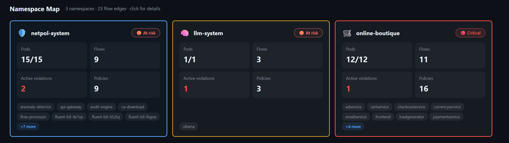
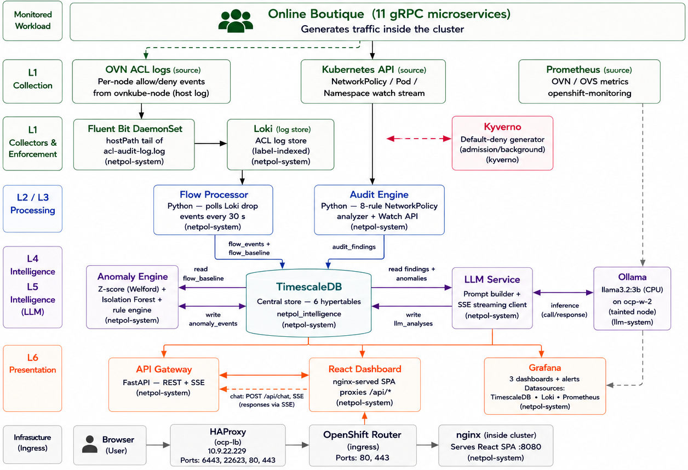
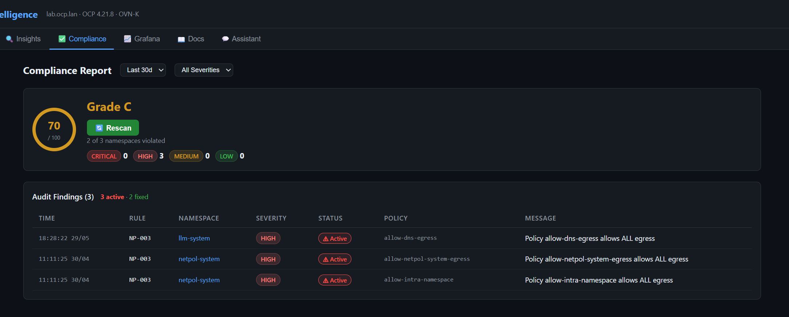
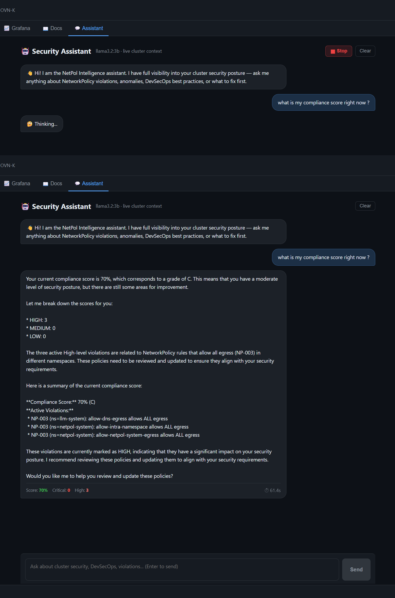
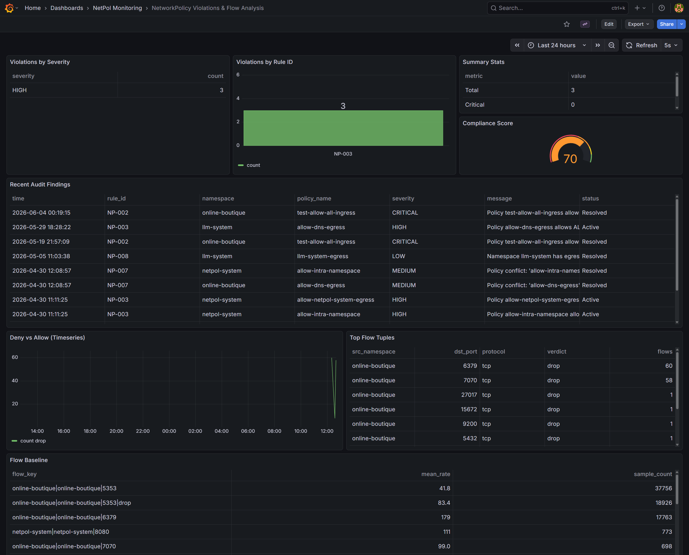
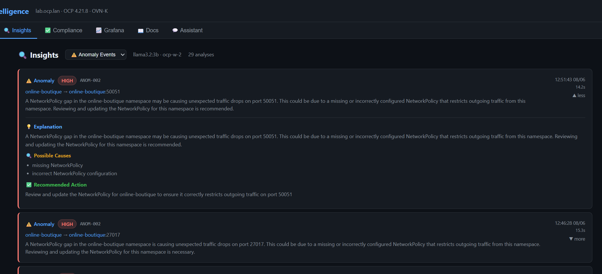

# NetworkPolicy Intelligence System (NPI)

### Intelligent Network Anomaly Detection & Kubernetes NetworkPolicy Compliance for OpenShift

[](https://www.openshift.com/)
[](https://github.com/ovn-org/ovn-kubernetes)
[](https://www.python.org/)
[](https://react.dev/)
[](https://hub.docker.com/u/nassimsai)

---

## 📌 Project Overview

**NPI** is a six-layer security observability platform for **OpenShift / Kubernetes clusters** that combines live network flow analysis, statistical and machine-learning anomaly detection, automated NetworkPolicy compliance auditing, and an on-cluster LLM assistant into a single intelligence layer sitting on top of **OVN-Kubernetes**.

Rather than relying on a human to manually inspect `NetworkPolicy` YAML for security gaps, or to eyeball dashboards for suspicious traffic, NPI watches cluster-native signals  OVN ACL drop logs, live `NetworkPolicy` objects, and time-series flow statistics and turns them into structured findings, ranked anomalies, and plain-English explanations a security engineer can act on immediately.

This project was developed as a **PFE (End-of-Study Engineering Project)** at **NextStep IT** (Tunis, Tunisia), in partnership with **TEK-UP University**.

[](docs/screenshots/dashboard-overview.png)

---

## 🎯 Objectives

- Detect anomalous network flows in real time using statistical and ML-based methods
- Automatically audit Kubernetes `NetworkPolicy` resources against a security rule catalogue
- Correlate anomalies and policy violations into a single compliance score per namespace
- Provide natural-language explanations and remediation guidance via an on-cluster LLM with no data ever leaving the cluster
- Demonstrate zero-trust NetworkPolicy design on a real bare-metal OpenShift cluster running OVN-Kubernetes

---

## 🏗️ Architecture Overview

NPI is built as **six cooperating layers**, deployed as independent microservices in the `netpol-system` and `llm-system` namespaces:

| Layer | Component | Role |
|---|---|---|
| 1. Observability | Fluent Bit → Loki | Collects OVN-Kubernetes ACL flow/drop logs cluster-wide |
| 2. Flow Processing | `flow-processor` | Converts raw OVN drop events into structured flow records, builds per-namespace-pair baselines (Welford online algorithm) |
| 3. Anomaly Detection | `anomaly-detector` | Three-tier detection: Welford/Z-score statistical spikes, deterministic rule matches, and Isolation Forest (scikit-learn) for multivariate outliers |
| 4. Policy Audit | `audit-engine` | Watches live `NetworkPolicy` objects via the Kubernetes API and evaluates them against an 8-rule security catalogue (NP-001–NP-008) |
| 5. Intelligence | `llm-service` (Ollama / `llama3.2:3b`) | Generates plain-English explanations, attack-scenario framing, and YAML remediation for findings fully on-cluster, streamed via SSE |
| 6. Presentation | `api-gateway` + `netpol-dashboard` (React 18) | REST + SSE API and a live dashboard: namespace map, anomaly timeline, compliance report, and an LLM-powered chat assistant |

All data is persisted in **TimescaleDB** hypertables and visualized live in **Grafana**.

[](docs/diagrams/npi-architecture.png)

---

## 🧰 Technologies Used

| Category | Stack |
|---|---|
| Cluster | OpenShift 4.21.8 (bare-metal UPI), OVN-Kubernetes CNI |
| Backend | Python 3.11, FastAPI, Kubernetes Python client v29 |
| ML / Stats | scikit-learn (Isolation Forest), NumPy, Welford's online algorithm |
| LLM | Ollama, `llama3.2:3b` (Q4 quantized, CPU-only inference) |
| Database | TimescaleDB (PostgreSQL + hypertables) |
| Frontend | React 18, Vite, Recharts |
| Observability | Fluent Bit, Loki, Prometheus, Grafana 12 |
| Policy Automation | Kyverno (generate/validate `ClusterPolicy`) |
| Build | OpenShift `BuildConfig` (`--binary --strategy=docker`) / Docker & Podman |
| Containers | Docker Hub  [`nassimsai`](https://hub.docker.com/u/nassimsai) |

---

## 🖥️ Cluster Topology

| Node | Role | IP | Notes |
|---|---|---|---|
| `ocp-lb` | Bastion / HAProxy | 10.9.22.229 | Source of truth: `~/netpol-intelligence/` |
| `ocp-cp-0` | Control plane | 10.9.22.230 | |
| `ocp-w-0` | Storage worker | 10.9.22.231 | Loki, TimescaleDB, `flow-processor` |
| `ocp-w-1` | Intelligence worker | 10.9.22.232 | `audit-engine`, `anomaly-detector`, `api-gateway` |
| `ocp-w-2` | LLM-dedicated worker | 10.9.22.233 | 12 vCPU, taint `dedicated=llm:NoSchedule`, runs Ollama |

Domain: `lab.ocp.lan` · Apps: `*.apps.lab.ocp.lan` · Namespaces: `netpol-system`, `llm-system`, `online-boutique` (test workload), `kyverno`

---

## 🐳 Prebuilt Images

All six services are published as standalone, portable images on Docker Hub no OpenShift `BuildConfig` required to redeploy elsewhere:

| Service | Image | Description |
|---|---|---|
| `audit-engine` | [`nassimsai/audit-engine`](https://hub.docker.com/r/nassimsai/audit-engine) | NetworkPolicy compliance audit engine (NP-001–NP-008) |
| `flow-processor` | [`nassimsai/flow-processor`](https://hub.docker.com/r/nassimsai/flow-processor) | OVN ACL drop-log → flow record + baseline builder |
| `anomaly-detector` | [`nassimsai/anomaly-detector`](https://hub.docker.com/r/nassimsai/anomaly-detector) | Z-score, rule-based, and Isolation Forest anomaly detection |
| `llm-service` | [`nassimsai/llm-service`](https://hub.docker.com/r/nassimsai/llm-service) | On-cluster LLM orchestration (Ollama client, SSE streaming) |
| `api-gateway` | [`nassimsai/api-gateway`](https://hub.docker.com/r/nassimsai/api-gateway) | FastAPI REST + SSE gateway for the dashboard |
| `netpol-dashboard` | [`nassimsai/netpol-dashboard`](https://hub.docker.com/r/nassimsai/netpol-dashboard) | React 18 SPA (multi-stage build → nginx) |

Each image is tagged `latest` and `v1.0-pfe2026` (defense snapshot).

```bash
docker pull docker.io/nassimsai/audit-engine:v1.0-pfe2026
```

---

## 🚀 Quick Start

### Option A Deploy on OpenShift using prebuilt Docker Hub images (recommended)

```bash
git clone https://github.com/nassim-saii/netpol-intelligence.git
cd netpol-intelligence

# Create namespaces
oc apply -f deploy/namespaces.yaml

# Create secrets (fill in your own credentials first see deploy/secrets.example.yaml)
oc apply -f deploy/secrets.yaml

# Deploy TimescaleDB, Kyverno policies, and all six services
oc apply -f deploy/
oc rollout status deployment/audit-engine -n netpol-system
oc rollout status deployment/flow-processor -n netpol-system
oc rollout status deployment/anomaly-detector -n netpol-system
oc rollout status deployment/llm-service -n netpol-system
oc rollout status deployment/api-gateway -n netpol-system
oc rollout status deployment/netpol-dashboard -n netpol-system
```

Full step-by-step instructions (including Ollama model pull, Grafana dashboard import, and Kyverno setup) are in [`NPI_Deployment_Runbook.md`](docs/NPI_Deployment_Runbook.md).

### Option B Build from source inside OpenShift (original air-gap-capable pipeline)

```bash
oc new-build --name=audit-engine --binary --strategy=docker -n netpol-system
oc start-build audit-engine --from-dir=services/audit-engine/ --follow
# repeat per service see docs/NPI_Deployment_Runbook.md, Section 3
```

> ℹ️ Option A trades the original air-gap build guarantee for portability  the images are built with internet access and pushed to Docker Hub, but the resulting deployment needs no OpenShift-internal build step and can be redeployed on any cluster with a `docker pull`.

---

## 🔍 NetworkPolicy Audit Rule Catalogue

| Rule ID | Severity | Check |
|---|---|---|
| NP-001 | HIGH | Default-deny ingress present per namespace |
| NP-002 | CRITICAL | Overly permissive ingress (`{}` selector) |
| NP-003 | HIGH | Missing egress restriction |
| NP-004 | MEDIUM | Missing DNS egress rule (ports 53 **and** 5353) |
| NP-005 | MEDIUM | Namespace label selector best practices |
| NP-006 | LOW | Policy naming/documentation conventions |
| NP-007 | HIGH | Cross-namespace traffic without explicit allow |
| NP-008 | CRITICAL | Router ingress path missing dual namespace selector |

Findings feed a per-namespace **compliance score**: `100 − (CRITICAL×20 + HIGH×10 + MEDIUM×5 + LOW×2)`, graded A–F.

---

## 🧪 Measured Performance

| Metric | Result |
|---|---|
| LLM time-to-first-token | 3.8 s |
| Full LLM analysis (SSE stream complete) | 11.3 s |
| Z-score spike detection latency | 84 s |
| Port-scan detection latency | 98 s |
| Audit rule evaluation latency | < 10 s |
| End-to-end test scenarios passed | 8 / 8 |
| Isolation Forest first live detection | score −0.5004, trained on 8 samples |

---

## 📂 Repository Structure

```
netpol-intelligence/
├── services/
│   ├── audit-engine/          ← Policy compliance audit engine
│   ├── flow-processor/        ← OVN flow ingestion + baselining
│   ├── anomaly-detector/      ← Z-score / rules / Isolation Forest
│   └── llm-service/           ← Ollama orchestration (SSE)
├── netpol-p4/
│   ├── api-gateway/           ← FastAPI REST + SSE gateway
│   ├── frontend/              ← React 18 dashboard (Vite + nginx)
│   └── deploy/                ← Phase 4 manifests
├── deploy/                    ← Deployment manifests (all phases)
├── kyverno-policies/          ← ClusterPolicy definitions
├── grafana/                   ← Dashboard JSON exports
├── docs/                      ← Runbooks, diagrams, screenshots
└── README.md
```

---

## 📊 Dashboard Features

| Tab | Component | Highlights |
|---|---|---|
| Namespace Map | `App.jsx` | Live per-namespace risk overview: pods, flows, active violations |
| Anomaly Timeline | `AnomalyTimeline.jsx` | Live anomaly feed with severity coloring |
| Compliance | `ComplianceReport.jsx` | Score circle (0–100 %), grade (A–F), severity breakdown (Recharts) |
| Assistant | `Chat.jsx` | Streaming SSE chatbot powered by `llama3.2:3b`, live cluster context |

---

## 📸 Screenshots

| Compliance Report | AI Assistant |
|---|---|
|  |  |

| Grafana  Policy Violations | Anomaly Timeline |
|---|---|
|  |  |

---

## ⚠️ Known Operational Behaviours

- `oc start-build` does **not** auto-cycle running pods always follow with `oc rollout restart`
- Ollama deployment strategy must be `Recreate` (two 10+ vCPU pods cannot coexist on one node)
- OVN-Kubernetes evaluates DNS post-DNAT allow **both** ports 53 and 5353 in egress rules
- OCP Router ingress NetworkPolicies require **two** separate `from:` entries (namespace-name selector *and* `policy-group=ingress`)

Full list in [`docs/NPI_Deployment_Runbook.md`](docs/NPI_Deployment_Runbook.md).

---

## 👨‍🎓 Authors & Supervision

- **Nassim Saii**  Final-year Network & System Security Engineering student, TEK-UP University

**Industrial Supervisor:** Mouna Belghith  Cloud & Infrastructure Engineer, NextStep IT\
**Academic Supervisor:** Khaoula Ammar  TEK-UP University

Class: Network & System Security Engineering · Academic Year: 2025–2026

---

## 📜 License

This project was developed for academic purposes as part of a PFE (End-of-Study Engineering Project). All rights reserved unless otherwise noted.
